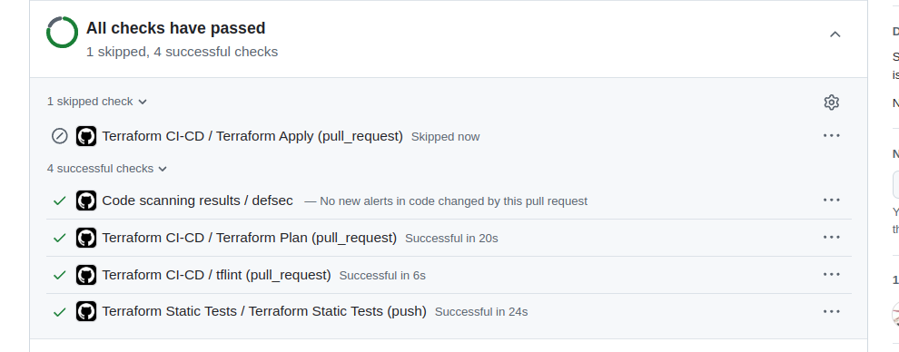
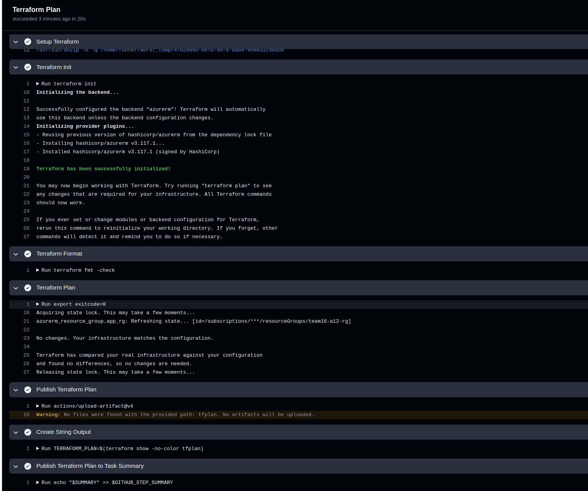

# CST8918-W25-Lab12

## Team Members
- Person A: Li Zhou (GitHub: zhou0265)
- Person B: Yinyuan Chen (GitHub: Gundami)

## Setup Instructions
1. **Repository Setup**: Created by Li Zhou with Yinyuan Chen added as a collaborator.
2. **Azure Configuration**:
   - Terraform backend configured with Azure Blob Storage for state management.
   - Azure AD Workload Identity Federation set up for GitHub Actions authentication.
   - Secrets (`AZURE_CLIENT_ID`, `AZURE_TENANT_ID`, `AZURE_SUBSCRIPTION_ID`) added to GitHub repo.
3. **Workflows**:
   - Static analysis runs on every push.
   - PRs to `main` trigger `terraform plan`.
   - Merges to `main` deploy the infrastructure.
   - Daily drift detection runs at midnight UTC.
4. **Testing**: Verified workflows by pushing changes to a `dev` branch, creating a PR, and merging to `main`.

## Submission Details
- **Repository URL**: [https://github.com/zhou0265/cst8918-w25-lab12](https://github.com/zhou0265/cst8918-w25-lab12) 

### Screenshots
#### Pull Request Checks
  
*Screenshot showing "All checks have passed" with expanded workflow steps.*

#### Terraform Plan
  
*Screenshot showing the expanded results of the Terraform Plan step in the PR.*

## Contributions
- **Li Zhou**: Configured Terraform backend, wrote initial `main.tf` and workflows, managed repository setup.
- **Yinyuan Chen**: Reviewed PRs, added variables and outputs, tested workflows, and updated README with screenshots.

Both team members collaborated equally via Git commits, PR reviews, and discussions to ensure a fully functional pipeline.

## Notes
- The `app` folder is empty as per lab instructions, representing the application code placeholder.
- All workflows have been tested and are functional as of March 31, 2025.